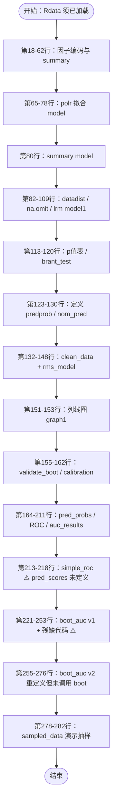

# 07 - depression.R 源代码详解

本文档对 `depression.R`（共 283 行）中的 **变量、函数、整体流程** 做逐段说明，便于阅读和维护源码。

---

## 一、脚本结构总览

```
第  1–16 行   环境准备（安装/加载包、随机种子）
第 18–62 行   数据预处理（Rdata 变量编码）
第 65–80 行   第一阶段建模：MASS::polr
第 82–109 行  中间过渡：datadist、na.omit、rms::lrm（model1）
第113–130 行  统计检验与自定义预测函数
第132–162 行  第二阶段建模：rms_model + 列线图 + 验证/校准
第164–218 行  ROC / AUC 分析（样本内 + 多阈值）
第221–282 行  Bootstrap AUC（含重复/残缺代码）
```

整体上是 **双模型架构**：

| 模型对象 | 函数 | 包 | 主要用途 |
|----------|------|-----|---------|
| `model` | `polr()` | MASS | 探索性有序回归、p 值、Brant 检验 |
| `model1` | `lrm()` | rms | 初步 rms 拟合（`x=FALSE, y=FALSE`，未深入使用） |
| `rms_model` | `lrm()` | rms | **主模型**：列线图、validate、calibrate、ROC |

---

## 二、整体流程图



---

## 三、环境准备（第 1–16 行）

### 3.1 安装的包

```r
install.packages('rms')
install.packages('ggplot2')
install.packages('pROC')
install.packages('caret')
install.packages('brant')
```

首次运行时会尝试安装；若已安装可注释掉以加速。

### 3.2 加载的包与用途

| 包 | 行号 | 脚本中实际用到的函数 |
|----|------|---------------------|
| `MASS` | 7 | `polr()` |
| `rms` | 8 | `datadist()`, `lrm()`, `nomogram()`, `validate()`, `calibrate()` |
| `ggplot2` | 9 | **未使用** |
| `pROC` | 10 | `roc()`, `auc()`, `ci.auc()` |
| `caret` | 11 | **未使用**（注释称用于数据分割） |
| `brant` | 12 | `brant()` |
| `Hmisc` | 13 | `rms` 依赖，间接使用 |
| `dplyr` | 14 | **未使用** |
| `boot` | 15 | `boot()`, `boot.ci()` |

### 3.3 随机种子

```r
set.seed(123)   # 第16行
```

保证 Bootstrap、抽样等随机过程可复现。后续第 198、238、279 行等处再次设置种子。

---

## 四、数据预处理（第 18–62 行）

所有操作直接修改 **`Rdata`** 对象（原地赋值）。

### 4.1 输入变量（来自 Rdata，预处理前）

| 变量名 | 行号 | 原始类型假设 | 预处理后 |
|--------|------|-------------|---------|
| `丈夫学历` | 18–20 | 数值 1/2/3 | `factor`，标签：大专本科/研究生/其他 |
| `本人职业` | 24–26 | 数值 1–5 | `factor`，5 类职业 |
| `吸烟` | 30–32 | 数值 1/2 | `factor`，是/否 |
| `倾诉方式` | 36–38 | 数值 1–4 | `factor`，无/被动/1-2人/主动 |
| `求助方式` | 42–44 | 数值 1–4 | `factor`，无/很少/有时/经常 |
| `分娩次数` | 48 | 任意可转数值 | `numeric` |
| `母乳` | 51–53 | 数值 1–3 | `factor`，否/混合/是 |
| `EPDS级别` | 58–61 | 数值 1–4 | 转为新列 **`抑郁等级`**（有序 factor） |

### 4.2 结局变量 `抑郁等级`（第 58–61 行）

```r
Rdata$抑郁等级 <- factor(Rdata$EPDS级别,
                     levels = c(1, 2, 3, 4),
                     labels  = c("正常", "轻度", "中度", "重度"),
                     ordered = TRUE)
```

- **来源**：`EPDS级别`
- **关键属性**：`ordered = TRUE`，供有序逻辑回归使用
- **levels 顺序**：正常 < 轻度 < 中度 < 重度

### 4.3 未在预处理中修改的变量

以下变量保持原样，直接进入模型：

| 变量 | 类型 | 说明 |
|------|------|------|
| `SSRS` | 连续 | 社会支持量表 |
| `PSQI` | 连续 | 睡眠质量指数 |
| `TPOab` | 连续 | 甲状腺抗体 |
| `孕酮` | 连续 | 孕酮 |
| `孕期EPDS` | 连续/整数 | 孕期 EPDS |

每段预处理后均有 `summary()` 输出，用于检查分布。

---

## 五、第一阶段建模：polr（第 65–80 行）

### 5.1 模型对象 `model`

```r
model <- polr(Rdata$抑郁等级 ~ SSRS + PSQI + Rdata$分娩次数 + TPOab +
              Rdata$孕酮 + Rdata$孕期EPDS + Rdata$丈夫学历 + Rdata$本人职业 +
              Rdata$吸烟 + Rdata$倾诉方式 + Rdata$求助方式 + Rdata$母乳,
            data = Rdata, Hess = TRUE)
```

| 项目 | 说明 |
|------|------|
| 因变量 | `Rdata$抑郁等级`（有序 4 类） |
| 自变量 | 12 个（6 连续 + 6 分类） |
| 数据 | **`Rdata` 全量**（含 NA 行，`polr` 按行删除 NA） |
| `Hess = TRUE` | 返回 Hessian 矩阵，用于标准误计算 |

### 5.2 输出

- 第 80 行：`summary(model)` — 系数、标准误、t 值

---

## 六、中间过渡（第 82–109 行）

### 6.1 `Ddist` 与 `options(datadist)`（第 82–94 行）

```r
Ddist <- datadist(Rdata$SSRS, Rdata$PSQI, ...)  # 逐变量传入
options(datadist = 'Ddist')
```

| 变量 | 类型 | 说明 |
|------|------|------|
| `Ddist` | `datadist` 对象 | 为 `rms` 包提供变量分布信息（列线图/预测用） |
| 问题 | — | **用法不规范**：`rms` 推荐 `datadist(整个数据框)`，而非逐个变量 |

### 6.2 `Rdata_clean`（第 95 行）

```r
Rdata_clean <- na.omit(Rdata)
```

| 项目 | 说明 |
|------|------|
| 含义 | 删除 **任意列** 含 NA 的整行 |
| 与 Rdata 关系 | `Rdata` 的完整案例子集 |
| 后续使用 | `model1`、`boot()`、`sampled_data` |

### 6.3 `model1`（第 97–109 行）

```r
model1 <- lrm(抑郁等级 ~ SSRS + PSQI + 分娩次数 + TPOab + 孕酮 + 孕期EPDS +
              丈夫学历 + 本人职业 + 吸烟 + 倾诉方式 + 求助方式 + 母乳,
            data = Rdata_clean, x = FALSE, y = FALSE)
```

| 参数 | 含义 |
|------|------|
| `x = FALSE, y = FALSE` | 不保存设计矩阵，节省内存 |
| 与 `rms_model` 区别 | 同一公式，但 **未** 用于列线图/验证；后续代码几乎不再引用 `model1` |

---

## 七、统计检验与自定义函数（第 113–130 行）

### 7.1 系数 p 值表 `ctable`（第 113–116 行）

```r
?(ctable <- coef(summary(model)))          # ⚠️ 第113行 ? 会导致语法错误
p_values <- pnorm(abs(ctable[, "t value"]), lower.tail = FALSE) * 2
ctable <- cbind(ctable, "p value" = p_values)
print(ctable)
```

| 变量 | 说明 |
|------|------|
| `ctable` | `polr` 模型系数汇总表 + 双侧 p 值 |
| 原理 | `polr` 的 `summary()` 不直接给 p 值，用 t 值近似正态求 p |
| 问题 | 第 113 行前缀 `?` 为帮助查询语法，**会中断运行** |

### 7.2 Brant 检验 `brant_test`（第 119–120 行）

```r
brant_test <- brant(model)
print(brant_test)
```

| 项目 | 说明 |
|------|------|
| 目的 | 检验有序逻辑回归的 **比例优势（平行线）假设** |
| 对象 | 基于 `model`（polr） |
| 性质 | 模型前提检验，**不是**预测准确率验证 |

### 7.3 自定义函数

#### `predprob`（第 123–126 行）

```r
predprob <- function(model, newdata) {
  preds <- predict(model, newdata = newdata, type = "probs")
  colMeans(preds)   # 对所有样本的预测概率按列求均值
}
```

| 项目 | 说明 |
|------|------|
| 输入 | `model`（polr 对象）、`newdata`（新数据框） |
| 输出 | 各类别 **平均预测概率** 向量 |
| 脚本中 | **定义后未调用** |

#### `nom_pred`（第 128–130 行）

```r
nom_pred <- function(model, newdata) {
  predict(model, newdata = newdata, type = "probs")
}
```

| 项目 | 说明 |
|------|------|
| 输入 | `model`、`newdata` |
| 输出 | 每个样本属于各等级的 **概率矩阵** |
| 脚本中 | **定义后未调用**（可能供列线图手动预测用） |

---

## 八、第二阶段主模型：rms_model（第 132–162 行）

### 8.1 数据准备

```r
clean_data <- na.omit(Rdata)                    # 第132行，与 Rdata_clean 相同操作
clean_data$抑郁等级 <- factor(..., ordered = TRUE) # 第134行，确保有序
dd <- datadist(clean_data)                       # 第135行，正确用法
options(datadist = "dd")                         # 第136行
```

| 变量 | 与 Rdata 关系 | 说明 |
|------|--------------|------|
| `clean_data` | `na.omit(Rdata)` | 完整案例，**主分析数据集** |
| `dd` | 基于 `clean_data` | 替代前面不规范的 `Ddist` |

### 8.2 主模型 `rms_model`（第 137–149 行）

```r
rms_model <- lrm(抑郁等级 ~ SSRS + PSQI + 丈夫学历 + 本人职业 + 吸烟 +
                 倾诉方式 + 求助方式 + 分娩次数 + 母乳 + TPOab + 孕酮 + 孕期EPDS,
               data = clean_data, x = TRUE, y = TRUE)
```

| 参数 | 含义 |
|------|------|
| `x = TRUE, y = TRUE` | 保存设计矩阵和结局向量，供 `validate`/`calibrate`/`nomogram` 使用 |
| 公式 | 与 `model1` 相同 12 个自变量，顺序略有不同 |

### 8.3 列线图 `graph1`（第 151–153 行）

```r
graph1 <- nomogram(rms_model, fun = plogis, lp = F, funlabel = "产后抑郁风险")
plot(graph1)
```

| 参数 | 说明 |
|------|------|
| `fun = plogis` | 将线性预测值映射为 logistic 概率 |
| `lp = F` | 不显示线性预测子刻度 |
| `funlabel` | 图例标签「产后抑郁风险」 |
| 输出 | 图形窗口中的 **Nomogram 列线图** |

### 8.4 Bootstrap 内部验证 `validate_boot`（第 155–159 行）

```r
validate_boot <- validate(rms_model, method = "boot", B = 1000)
corrected_cindex <- validate_boot["Dxy", "index.corrected"] / 2 + 0.5
```

| 变量 | 说明 |
|------|------|
| `validate_boot` | 含 `index.orig`（原始）和 `index.corrected`（校正）等指标 |
| `corrected_cindex` |  optimism-corrected **C-index**（一致性指数） |
| 方法 | 1000 次 Bootstrap 重抽样内部验证 |

### 8.5 校准 `calibration`（第 161–162 行）

```r
calibration <- calibrate(rms_model, method = "boot", B = 1000)
plot(calibration)
```

| 变量 | 说明 |
|------|------|
| `calibration` | Bootstrap 校准对象 |
| 输出 | **校准曲线图**：预测概率 vs 观测频率 |

---

## 九、ROC / AUC 分析（第 164–218 行）

### 9.1 基础预测与二值化（第 164–174 行）

```r
pred_probs <- predict(rms_model, type = "fitted")
depression_levels <- sort(unique(clean_data$抑郁等级))
binary_outcome <- as.numeric(clean_data$抑郁等级 > min(depression_levels))
roc_obj <- roc(binary_outcome, pred_probs)
auc_value <- auc(roc_obj)
ci <- ci.auc(roc_obj, method = "bootstrap", boot.n = 1000)
```

| 变量 | 类型 | 说明 |
|------|------|------|
| `pred_probs` | numeric 向量 | 每个样本的 **拟合概率**（in-sample） |
| `depression_levels` | 有序因子 levels | 通常：正常、轻度、中度、重度 |
| `binary_outcome` | 0/1 | **是否高于最低等级**（即是否非「正常」） |
| `roc_obj` | pROC 对象 | ROC 曲线 |
| `auc_value` | 标量 | AUC |
| `ci` | 向量 | AUC 的 Bootstrap 95% CI |

### 9.2 多阈值 AUC 循环（第 176–211 行）

```r
roc_list <- list()
auc_results <- data.frame(Threshold, AUC, Lower_CI, Upper_CI)
thresholds <- depression_levels[-length(depression_levels)]  # 去掉最高等级

for (i in seq_along(thresholds)) {
  binary_outcome <- as.numeric(clean_data$抑郁等级 >= thresholds[i])
  roc_obj <- roc(binary_outcome, pred_probs, quiet = TRUE)
  roc_list[[i]] <- roc_obj
  ci <- ci.auc(roc_obj, method = "bootstrap", boot.n = 2000)
  auc_results <- rbind(auc_results, ...)
}
print(auc_results)
```

| 变量 | 说明 |
|------|------|
| `thresholds` | 通常为：正常、轻度、中度（作为切点） |
| 循环逻辑 | 依次计算 **≥ 轻度**、**≥ 中度**、**≥ 重度** 的 AUC |
| `roc_list` | 存储各阈值的 ROC 对象 |
| `auc_results` | 汇总表：Threshold / AUC / Lower_CI / Upper_CI |

### 9.3 简化 ROC（第 213–218 行）⚠️

```r
simple_roc <- roc(as.numeric(clean_data$抑郁等级), pred_scores)  # pred_scores 未定义
```

| 问题 | 说明 |
|------|------|
| `pred_scores` | **从未定义**，应为 `pred_probs` 或其他预测得分 |
| 意图 | 将有序等级当作连续变量做 ROC |

---

## 十、Bootstrap AUC 部分（第 221–282 行）

此段存在 **三版重复/冲突代码**，是脚本最难维护的部分。

### 10.1 第一版 `boot_auc`（第 221–236 行）

```r
boot_auc <- function(data, indices) {
  sampled_data <- data[indices, ]
  boot_model <- lrm(..., data = sampled_data, x = TRUE, y = TRUE)
  pred_prob <- predict(boot_model, newdata = Rdata_clean, type = "fitted")
  roc_obj <- roc(Rdata_clean$抑郁等级, pred_prob)
  return(as.numeric(roc_obj$auc))
}
```

| 项目 | 说明 |
|------|------|
| 逻辑 | Bootstrap 样本上拟合 → 在 **全量 Rdata_clean** 上预测 |
| 问题 | 预测集与拟合集不一致；`抑郁等级` 为 4 类因子直接传入 `roc()`，语义不清 |

### 10.2 第一次 boot 调用 + 残缺代码（第 238–253 行）⚠️

```r
set.seed(123)
boot_results <- boot(data = Rdata_clean, statistic = boot_auc, R = 1000)

# 第241-245行：孤立的函数体片段，无 function 头
  roc_obj <- roc(Rdata_clean$抑郁等级, pred_prob)
  return(as.numeric(roc_obj$auc))
}

set.seed(123)
boot_results <- boot(data = sample_data, statistic = boot_auc, R = 1000)  # sample_data 未定义

mean_auc <- mean(boot_results$t)
auc_ci <- boot.ci(boot_results, type = "bca")
```

| 问题 | 说明 |
|------|------|
| 241–245 行 | 残缺代码块，会导致 **语法错误** |
| `sample_data` | **未定义** |
| `mean_auc` / `auc_ci` | 意图输出 Bootstrap AUC 及 BCa 置信区间 |

### 10.3 第二版 `boot_auc`（第 255–276 行）

```r
boot_auc <- function(data, indices) {
  sampled_data <- data[indices, ]
  boot_model <- lrm(..., data = sampled_data, x = TRUE, y = TRUE)
  pred_probs <- predict(boot_model, newdata = sampled_data, type = "fitted")
  binary_outcome <- as.numeric(sampled_data$抑郁等级) - 1
  roc_obj <- roc(binary_outcome, pred_probs)
  return(as.numeric(roc_obj$auc))
}
```

| 项目 | 说明 |
|------|------|
| 改进 | 在同一 `sampled_data` 上拟合与预测 |
| 二值化 | `as.numeric(抑郁等级) - 1`：将 1–4 转为 0–3，**不是标准 0/1 二分类** |
| 问题 | **覆盖了** 第一版函数，但 **未再次调用** `boot()` |

### 10.4 抽样演示（第 278–282 行）

```r
dim(Rdata_clean)
set.seed(123)
sample_indices <- sample(1:nrow(Rdata_clean), replace = TRUE)
sampled_data <- Rdata_clean[sample_indices, ]
dim(sampled_data)
```

| 变量 | 说明 |
|------|------|
| `sample_indices` | 有放回抽样的行索引 |
| `sampled_data` | 一次 Bootstrap 样本（行数 = `nrow(Rdata_clean)`） |
| 用途 | 演示/调试，**未接入后续分析** |

---

## 十一、全部变量速查表

### 11.1 数据对象

| 变量名 | 行号 | 来源 | 含义 |
|--------|------|------|------|
| `Rdata` | — | 外部加载 | 原始数据（脚本前提） |
| `Rdata_clean` | 95 | `na.omit(Rdata)` | 完整案例子集 |
| `clean_data` | 132 | `na.omit(Rdata)` | 与 `Rdata_clean` 实质相同 |
| `sampled_data` | 281 | Bootstrap 抽样 | 一次有放回样本 |

### 11.2 模型对象

| 变量名 | 行号 | 函数 | 用途 |
|--------|------|------|------|
| `model` | 65 | `polr()` | 探索回归、Brant 检验、p 值 |
| `model1` | 97 | `lrm()` | 初步拟合，后续未用 |
| `rms_model` | 137 | `lrm()` | **主模型**（列线图、验证、ROC） |

### 11.3 rms 配置对象

| 变量名 | 行号 | 说明 |
|--------|------|------|
| `Ddist` | 82 | 不规范的 datadist（逐变量） |
| `dd` | 135 | 规范的 datadist（整表） |

### 11.4 检验与结果对象

| 变量名 | 行号 | 说明 |
|--------|------|------|
| `ctable` | 113 | polr 系数 + p 值 |
| `brant_test` | 119 | 比例优势检验结果 |
| `validate_boot` | 155 | Bootstrap 验证结果 |
| `corrected_cindex` | 158 | 校正 C-index |
| `calibration` | 161 | 校准对象 |
| `pred_probs` | 164 | 拟合概率向量 |
| `depression_levels` | 166 | 抑郁等级 levels |
| `binary_outcome` | 168/189 | 二值化结局（多处重新定义） |
| `roc_obj` | 170/192 | ROC 对象（循环内覆盖） |
| `auc_value` | 171 | 单次 AUC |
| `ci` | 172/199 | AUC 置信区间 |
| `roc_list` | 176 | 多阈值 ROC 列表 |
| `auc_results` | 177 | 多阈值 AUC 汇总表 |
| `thresholds` | 184 | 切点 levels |
| `boot_results` | 239/248 | Bootstrap 结果（可能报错） |
| `mean_auc` | 250 | Bootstrap AUC 均值 |
| `auc_ci` | 251 | BCa 置信区间 |
| `graph1` | 151 | 列线图对象 |

### 11.5 自定义函数

| 函数名 | 行号 | 是否被调用 |
|--------|------|-----------|
| `predprob()` | 123 | 否 |
| `nom_pred()` | 128 | 否 |
| `boot_auc()` | 221 / 255 | 仅第一版在第 239 行被 `boot()` 调用 |

---

## 十二、调用的外部函数一览

| 函数 | 包 | 调用位置 | 作用 |
|------|-----|---------|------|
| `factor()` | base | 18–61 | 分类/有序编码 |
| `as.numeric()` | base | 48, 168, 189, 213, 265 | 类型转换 |
| `summary()` | base | 多处 | 描述统计 / 模型摘要 |
| `na.omit()` | base | 95, 132 | 删除含 NA 行 |
| `polr()` | MASS | 65 | 有序逻辑回归 |
| `coef()` | base | 113 | 提取系数 |
| `pnorm()` | stats | 114 | 计算 p 值 |
| `cbind()` / `print()` | base | 115–116 | 输出 |
| `brant()` | brant | 119 | 比例优势检验 |
| `predict()` | 各模型 | 124, 129, 164, 231, 264 | 预测 |
| `colMeans()` | base | 125 | 概率均值 |
| `datadist()` | rms | 82, 135 | 变量分布描述 |
| `options()` | base | 94, 136 | 设置 datadist |
| `lrm()` | rms | 97, 137, 226, 259 | rms 有序/二分类回归 |
| `nomogram()` | rms | 151 | 列线图 |
| `plot()` | base/rms | 153, 162, 214 | 作图 |
| `validate()` | rms | 155 | Bootstrap 内部验证 |
| `calibrate()` | rms | 161 | 校准曲线 |
| `roc()` | pROC | 170, 192, 213, 234, 274 | ROC 曲线 |
| `auc()` | pROC | 171, 204, 215 | AUC |
| `ci.auc()` | pROC | 172, 199, 216 | AUC 置信区间 |
| `cat()` | base | 159, 173, 217, 252 | 打印文本 |
| `sort()` / `unique()` | base | 166 | 等级排序 |
| `data.frame()` / `rbind()` | base | 177, 202 | 结果汇总 |
| `paste()` | base | 203 | 阈值标签 |
| `seq_along()` | base | 187 | 循环索引 |
| `set.seed()` | base | 16, 198, 238, 247, 279 | 随机种子 |
| `boot()` | boot | 239, 248 | Bootstrap |
| `boot.ci()` | boot | 251 | Bootstrap CI |
| `mean()` | base | 250 | 均值 |
| `sample()` | base | 280 | 有放回抽样 |
| `dim()` | base | 278, 282 | 维度检查 |

---

## 十三、已知问题汇总

| 行号 | 问题 | 影响 |
|------|------|------|
| 113 | `?(ctable <- ...)` 含帮助符 `?` | 语法/运行中断 |
| 82–93 | `datadist()` 逐变量传入 | 不规范，后续被 `dd` 替代 |
| 132 vs 95 | `clean_data` 与 `Rdata_clean` 重复定义 | 冗余，易混淆 |
| 213 | `pred_scores` 未定义 | 运行报错 |
| 241–245 | 孤立函数体片段 | 语法错误 |
| 248 | `sample_data` 未定义 | 运行报错 |
| 221 vs 255 | `boot_auc` 定义两次，第二版未调用 | 逻辑混乱 |
| 265 | `as.numeric(抑郁等级) - 1` 非标准 0/1 | ROC 语义不明确 |
| 多处 | 无训练/测试划分，验证均为 in-sample | 泛化能力未知 |

---

## 十四、推荐阅读顺序

若需理解或修改源码，建议按以下顺序阅读：

1. **第 18–62 行** — 弄清输入变量如何编码
2. **第 65–78 行** — 第一个模型 `model` 的公式与数据
3. **第 132–148 行** — 主模型 `rms_model`（后续分析的核心）
4. **第 151–162 行** — 可视化与内部验证
5. **第 164–211 行** — ROC/AUC 评估逻辑
6. **第 221–282 行** — Bootstrap 部分（注意错误段）

相关文档：

- [02-Rdata数据要求.md](./02-Rdata数据要求.md) — 输入数据规格
- [04-建模后的验证逻辑.md](./04-建模后的验证逻辑.md) — 验证方法说明
- [05-训练集与测试集划分.md](./05-训练集与测试集划分.md) — 数据划分说明
- [06-Bootstrap抽样说明.md](./06-Bootstrap抽样说明.md) — Bootstrap 概念
